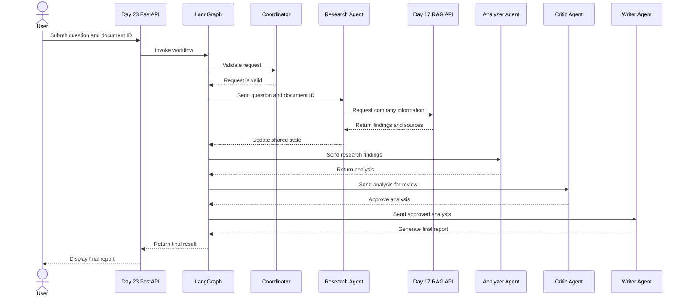

# Day 23 - Multi-Agent Sequence Diagram

```mermaid
sequenceDiagram
    actor User
    participant API as Day 23 FastAPI
    participant LG as LangGraph
    participant C as Coordinator
    participant R as Research Agent
    participant RAG as Day 17 RAG API
    participant A as Analyzer Agent
    participant CR as Critic Agent
    participant W as Writer Agent

    User->>API: Submit question and document ID
    API->>LG: Invoke workflow
    LG->>C: Validate request
    C-->>LG: Request is valid
    LG->>R: Send question and document ID
    R->>RAG: Request company information
    RAG-->>R: Return findings and sources
    R-->>LG: Update shared state
    LG->>A: Send research findings
    A-->>LG: Return analysis
    LG->>CR: Send analysis for review
    CR-->>LG: Approve analysis
    LG->>W: Send approved analysis
    W-->>LG: Generate final report
    LG-->>API: Return final result
    API-->>User: Display final report
```
